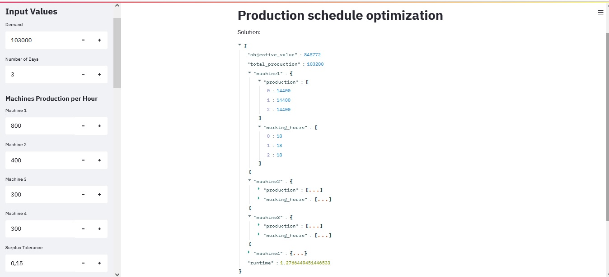

# **Production schedule optimization**

My aim with this project was to design an API to optimize the production schedule of a factory by taking into account the horizon of d days and the demand for P items. The solver will optimize each machine's production, working hours, and on/off schedule based on some constraints and the costs associated with each machine. Additionally, a user interface application has been developed to simplify the use of the API.

### **Interface**

When the API is on the interface can be used to make requests in the API. The interface looks like:



## **Setup**

*See solver section below about the solver executables.*

Install the dependencies from the requirements.txt file using the following command:

    pip install -r requirements.txt

Start the API with the following command:

    python main.py

In a separate terminal window, run the Streamlit app using the following command:

    streamlit run app.py

This will start the Streamlit app and open it in a browser window. The user can interact with the app to send requests to the API and view the responses.

To build the Docker image, run the following command:

    docker build -t solverapi .

And to start the Docker container and map port 9000 on the host to port 9000 on the container, run the following command:

    docker run -p 9000:9000 solverapi

In these examples the 9000 is the port.

### **Enviromental variables**

*See solver section below about the solver paths.*

The project must have a ```.env``` with:

    PORT="9000"
    URL="http://localhost:9000/"
    PATH_LOG='logs'

Where PORT is the port that the application will run, URL is the local URL of the appplication and PATH_log is the folder where the logging files will be written.

## **API**

### **Input**

```
{

    "demand": 100000,

    "n_days": 5,

    "machines_prod_per_hour": {
        "machine1": 800.5,
        "machine2": 400.6,
        "machine3": 300.7,
        "machine4": 300.7
    },

    # let demand_max = demand + demand * surplus_tolerance, 
    # so the production will be > demand and < demand_max.

    "surplus_tolerance": 0.15, 

    "minimum_working_hours": {
        "machine1": 16,
        "machine2": 16,
        "machine3": 12,
        "machine4": 12
    },

    "maximum_working_hours": {
        "machine1": 24, 
        "machine2": 20, 
        "machine3": 20, 
        "machine4": 20
    },

    # these are the parameters cost to plug in the machine cost function
    "machine_type1_mult1": 0.001,
    "machine_type1_add1": 1000,
    "machine_type2_mult1": 0.03,
    "machine_type2_add1": 1700,
    "machine_type3_mult1": 0.002,
    "machine_type3_mult2": 0.001,
    "machine_type3_add1": 300,

    # time limit for the solver
    "time_limit": 7,

    "request_id": 173
}
```

### **Output**

```
{
    # the objective value is the cost of the production.
    # total production is the total number of produced items.
    # each item in the lists corresponds to a day.

    'objective_value': 377820.0, 

    'total_production': 100000.0, 

    'machine1': {
        'production': [0, 0, 0, 0, 0], 
        'working_hours': [0, 0, 0, 0, 0]}, 

    'machine2': {
        'production': [8000, 8000, 8000, 8000, 8000], 
        'working_hours': [20, 20, 20, 20, 20]}, 

    'machine3': {
        'production': [6000, 6000, 6000, 6000, 6000], 
        'working_hours': [20, 20, 20, 20, 20]}, 

    'machine4': {
        'production': [6000, 6000, 6000, 6000, 6000], 
        'working_hours': [20, 20, 20, 20, 20]}, 

    'runtime': 6.705224275588989
}

```

## **The problem**

The aim of this optimization is the minimize the cost of production of a factory for an input demand based on the attributes/efficiency/working hours of the factory machines and the input number of days to produce the items.

The variables (decision variables) are P{m,d}, WorkingHours{m,d}, ActivateMachine{m,d}.

Where:

    P{m,d} is the production (number of items) of machine m on day d (integer). 

    WorkingHours{m,d} is the working hours of machine m on day d (integer).

    ActivateMachine{m,d} activates machine m on day d (binary).

### **Objective function** 

The objective function calculates the total cost of production over a certain number of days, by summing up the costs of using different types of machines on each day. The cost of using each machine is calculated using a different formula, and depends on the production (number of items) of the machine on that day.


    Machine 1:
        m1 = a_1 + b_1 * (P{1,d})^2

    Machine 2:
        m2 = a_2 + b_2 * P{2,d}

    Machine 3:
        m3 = a_3 + b_3 * P{3,d} + c_3 * (P{3,d})^2

    Machine 4:
        m4 = a_3 + b_3 * P{4,d} + c_3 * (P{4,d})^2

Where:

    a_i is the additive constant for machine type i (i=1,2,3)

    b_i is the a coefficient for machine type i

    c_3 is the quadratic coefficient for machine type 3

    P{m,d} is the production (number of items) of machine m on day d

### **Constraints**

The problem has the following constraints: 

**Constraint 1**: The sum of the production of all machines over all days must be greater than or equal to the demand.

    sum(P) >= Demand

**Constraint 2**: The sum of the production of all machines over all days must be less than or equal to the demand multiplied by a surplus tolerance factor.

    sum(P) <= Demand * (1 + SurplusTolerance)

**Constraint 3**: The production of each machine (m) on each day (d) is equal to the product of the number of hours the machine is operational on that day (WorkingHours) and the production rate of the machine (ProdPerHour).

    P{m,d} = WorkingHours{m,d} * ProdPerHour{m}

**Constraint 4**: The number of hours each machine operates on each day is greater than or equal to the minimum number of hours the machine (MinimumWorkingHours) must operate within that day multiplied by a binary variable (ActivateMachine) that activates the machine on that day.

    WorkingHours{m,d} >= MinimumWorkingHours{m,d} * ActivateMachine{m,d}

**Constraint 5**: The number of hours each machine operates on each day is less than or equal to a large constant M multiplied by a binary variable that activates the machine on that day. This constraint ensure that WorkingHours will be zero if ActivateMachine = 0.

    WorkingHours{m,d} <= M * ActivateMachine{m,d}

**Constraint 6**: The number of hours each machine operates on each day is less than or equal to the maximum number of hours the machine can operate within that day (MaximumWorkingHours).

    WorkingHours{m,d} <= MaximumWorkingHours{m, d}

## **Solvers**

- GLPK 4.65 (GNU Linear Programming Kit, http://www.gnu.org/software/glpk/) is a solver that can be used for solving large-scale linear programming (LP), and mixed-integer programming (MIP) problems, which is used as the MIP solver.

- Ipopt-3.11.1 (https://www.coin-or.org/download/binary/Ipopt/) is a large-scale nonlinear optimization solver, which is used as the nonlinear programming solver.

We used these two algorithms in *MindtPy* solver, which is Mixed-Integer Nonlinear Decomposition Toolbox in *Pyomo*. Decomposition because the problem is decomposed into a linear and a nonlinear part in the outer-approximation algorithm (OA) (Duran and Grossmann 1986).

### Paths

Ensure that the paths of the solver executables are added to the system path environmental variables. The paths are as follows:

    C:\glpk-4.65\w64
    C:\ipopt\bin

## **References**

- Duran, M.A., Grossmann, I.E. An outer-approximation algorithm for a class of mixed-integer nonlinear programs. Mathematical Programming 36, 307–339 (1986). https://doi.org/10.1007/BF02592064